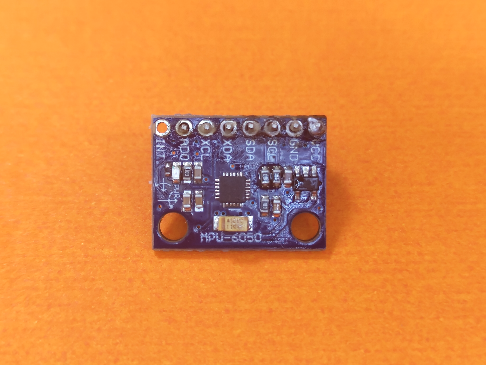
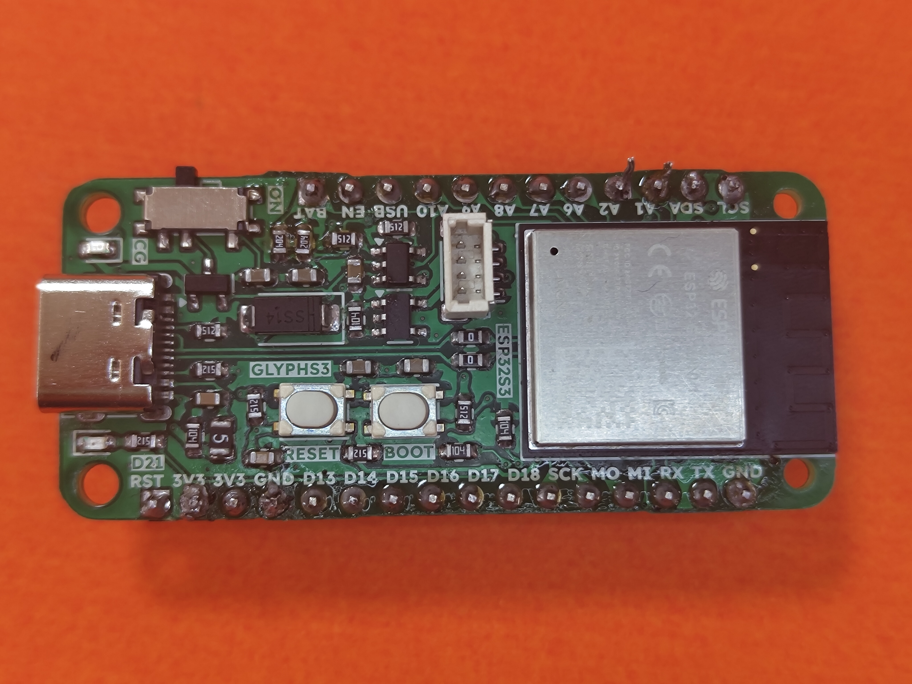

# E-01 Drive

E-01 Drive is a hardware platform built to make PID tuning easier, faster, and more intuitive. The current prototype uses a custom carrier PCB, an ESP32-S3 controller, an MPU-6050 IMU, a motor driver, and a compact two-wheel robot platform to test and demonstrate closed-loop control behavior in real hardware.

This document is based on three sources available in this workspace:

1. The project abstract titled `EdgeFeedControl: Edge AI-Driven PID Control Platform`.
2. The physical build photos provided for this project.
3. The hardware files in this folder, especially the KiCad PCB layout and manufacturing outputs.

Because the schematic file is currently empty, some integration details below are reconstructed from the PCB layout and photos rather than from a finished circuit schematic.

## Problem Statement

PID tuning is powerful but frustrating in practice. For many student, robotics, and embedded control projects, tuning a system still means repeated trial and error, unstable behavior, and slow iteration on real hardware.

E-01 Drive is intended to reduce that friction by providing a compact physical test platform where controller parameters can be adjusted, observed, and validated quickly. In the current form factor, it appears to target a two-wheel balancing or motion-control use case where stability and response quality matter directly.

## Current Hardware Application

From the uploaded photos and the project abstract structure, this build is best documented as a compact dual-motor control platform for experimenting with real-time PID-based stabilization and motion control.

The assembled system includes:

- A custom carrier PCB for integrating the control electronics.
- An ESP32-S3 development board as the main controller.
- An MPU-6050 IMU for motion and orientation sensing.
- A dual motor driver board for driving left and right DC gear motors.
- A small I2C OLED for local status display.
- A DC-DC power module for voltage conditioning.
- A Li-ion/LiPo battery as the portable power source.
- A toggle switch for power control.
- A 3D-printed or fabricated central body/chassis with two side-mounted gear motors and wheels.

## System Overview

At a high level, the system works like this:

1. The battery powers the platform through the toggle switch and DC-DC regulation stage.
2. The ESP32-S3 reads motion data from the MPU-6050 over an I2C-style sensor connection.
3. Control logic computes corrective output based on the selected PID parameters.
4. The motor driver converts those commands into power for the left and right motors.
5. The OLED provides a simple local interface for status, mode, or tuning feedback.

This architecture makes the prototype useful as a hardware validation platform for closed-loop control experiments, especially where rapid PID iteration is the main goal.

## Firmware and Tuning Software

The current software stack is best described as a hybrid of embedded control firmware on the robot and an external AI-assisted tuning service.

### Embedded Firmware Role

On the robot itself, the ESP32-S3 is responsible for the real-time control side of the system:

- reading motion data from the MPU-6050,
- running the balancing or motion-control loop,
- driving the motor driver with updated actuator commands,
- and presenting status or tuning feedback on the OLED.

In other words, the ESP32-S3 executes the live control loop, while the tuning logic determines which PID gains should be used.

### PID Tuning Objective

The firmware and surrounding software are designed to automatically determine effective PID gains (`Kp`, `Ki`, `Kd`) for real control systems, reducing manual trial-and-error.

The tuning process is organized into two phases:

1. `Offline tuning`:
   an initial tuning session that uses exploratory runs and recorded step-response results to find a strong baseline.
2. `Online tuning`:
   an adaptive phase that adjusts gains after the system is already running on real hardware.

The target system for this workflow is the self-balancing robot form factor shown in this project, where the key feedback variables are tilt angle, angular velocity, and wheel behavior, and the output is motor drive command or PWM.

### Ideal Tuning Flow

The firmware description provided for this project outlines the following tuning loop:

1. Run a P-only exploratory response on the real system.
2. Measure response characteristics such as settling time, overshoot, steady-state error, and stability.
3. Use those results to identify a matching simulated system or control profile.
4. Refine candidate PID values based on that matched behavior.
5. Deploy the suggested gains on hardware.
6. Feed the measured hardware result back into the system and repeat.

This gives the project a closed tuning loop rather than a one-time static calibration workflow.

### Approach Evolution

The project initially explored a reinforcement learning approach based on TD3 for automatic PID tuning across simulated plants. That route was later abandoned because the training setup did not deliver reliable real-world performance.

The current direction uses a cloud-hosted LLM as the tuning engine. In this design:

- a FastAPI service manages tuning-session state,
- the model receives step-response metrics from real tests,
- the model proposes updated PID gains,
- and the history of tested gains and measured outcomes is stored between iterations.

This means the robot firmware focuses on sensing, actuation, and applying gains, while the heavier tuning logic lives in the external software layer.

### Tuning Service Interface

According to the current firmware brief, the external tuning service exposes these endpoints:

| Endpoint | Purpose |
| --- | --- |
| `/init_session` | Start a tuning session with the system description |
| `/answer_questions` | Respond to clarifying questions from the tuning model |
| `/send_results` | Submit hardware results and receive the next PID set |
| `/accept` | Accept the current gains as the offline baseline |
| `/start_adaptive` | Begin the online adaptive tuning phase |
| `/breach` | Report a disturbance event and receive updated gains |

### Current Software Status

Based on the supplied firmware description, the current software state is:

| Item | Status |
| --- | --- |
| TD3 reinforcement learning tuner | Abandoned after insufficient performance |
| LLM-based offline tuner | Implemented |
| LLM-based online adaptive tuner | Implemented |
| Hardware integration with the self-balancing robot | In progress |
| Browser-based simulation visualizer | Built and tested |

Because the repository does not yet include the actual firmware source files or backend implementation, this section documents the current architecture and intended software behavior rather than line-by-line code.

## PCB and Module Mapping

The custom PCB file confirms these main modules:

| PCB Ref | Module | Role in system | Confidence |
| --- | --- | --- | --- |
| `U1` | `glyph-s3` | Main microcontroller board, consistent with the photographed ESP32-S3 dev board | Confirmed from PCB footprint and photo |
| `U2` | `gmod-motor-driver` | Dual motor control stage for the drive motors | Confirmed from PCB footprint and photo |
| `U3` | `mpu_6050` | IMU used for motion sensing and feedback | Confirmed from PCB footprint and photo |
| `U4` | `JST_XH_B2B-XH-A_1x02_P2.50mm_Vertical` | Motor or power connector | Confirmed from PCB footprint |
| `U5` | `JST_XH_B2B-XH-A_1x02_P2.50mm_Vertical` | Motor or power connector | Confirmed from PCB footprint |
| `U6` | `gmod-dc-dc` | DC-DC regulator/power-conditioning module | Confirmed from PCB footprint and photo |

The board therefore acts mainly as a clean integration layer between the controller, IMU, power stage, and motor drive hardware.

## Observed Hardware Inventory

The following bill of materials is directly visible in the build photos or supported by the PCB layout:

| Item | Description | Notes |
| --- | --- | --- |
| Custom PCB | Main integration board for modules and connectors | Black PCB with footprints for controller, IMU, motor driver, and connectors |
| ESP32-S3 board | Main processing and control unit | Photo label and PCB footprint indicate an ESP32-S3 module board |
| MPU-6050 module | Accelerometer and gyroscope sensing | Suitable for balancing and motion feedback |
| Motor driver module | Drives the two DC motors | Exact model not stated in files, but role is clear |
| OLED module | Small I2C display | Pins labeled `GND VCC SCL SDA` |
| DC-DC converter | Battery voltage conditioning | Adjustable module photographed separately |
| Toggle switch | Main power switch | Used for manual power control |
| Battery | `3.7V 1200mAh` rechargeable cell | Portable supply for the robot |
| Two TT gear motors | Left/right drive actuation | Mounted on opposite sides of chassis |
| Two wheels | Mechanical traction | Paired with the two motors |
| Central body | Main mechanical frame | Holds display and electronics stack |

## Physical Build Notes

Based on the photos, the physical prototype is arranged around a central rectangular body with one motor mounted on each side. The OLED is mounted on the front face of the chassis, while the custom PCB and modules are intended to form the internal electronics stack.

This kind of layout is well suited to:

- self-balancing robot experiments,
- drive stabilization tests,
- motion estimation with IMU feedback,
- and live tuning demonstrations where users can observe how parameter changes affect behavior.

## Power and Signal Flow

The exact net names are not yet documented in a finished schematic, but the most likely flow is:

- Battery to toggle switch
- Toggle switch to DC-DC converter
- Regulated power distributed to controller, sensor, display, and driver
- ESP32-S3 to MPU-6050 for motion feedback
- ESP32-S3 to OLED for status display
- ESP32-S3 to motor driver for actuator control
- Motor driver to left and right DC motors through board connectors

If you later add firmware and a completed schematic, this section should be expanded into a pin-by-pin connection table.

## Expected Demo Narrative

For hackathon presentation and judging, the build can be described as:

`A compact edge control platform that simplifies PID tuning on real hardware by combining sensing, actuation, embedded compute, and an immediate physical testbed.`

An effective live demo would show:

1. Powering the system from the onboard battery.
2. Reading orientation or motion from the MPU-6050.
3. Running a PID loop on the ESP32-S3.
4. Sending corrective motor commands through the motor driver.
5. Displaying status or tuning information on the OLED.
6. Showing how tuning changes improve stability, responsiveness, or smoothness.

## Files Available in This Folder

The workspace already contains the major hardware artifacts for this prototype:

| Path | Purpose |
| --- | --- |
| `E-01 Drive.kicad_pcb` | Main PCB layout and footprint placement |
| `E-01 Drive.kicad_sch` | Schematic container, currently effectively empty |
| `03_manufacturing/team5_gerber_x2/` | Gerber and drill outputs for fabrication |
| `E-01 Drive.step` | Mechanical CAD export |
| `E-01 Drive.stl` | Printable/mesh geometry export |
| `E-01 Drive.glb` | 3D model export for sharing or visualization |

## Documentation Gaps

To make this project fully reproducible, the next documentation improvements should be:

1. Add the actual firmware source files and controller implementation details.
2. Complete the KiCad schematic so wiring is captured formally.
3. Add a wiring table with controller pins, sensor pins, and motor driver connections.
4. Add operating voltage details for each module.
5. Add setup instructions for calibration, cloud tuning setup, PID tuning procedure, and safety limits.
6. Add measured results such as settling time, overshoot, or stability behavior.

## Photo Gallery

### Custom Carrier PCB

### Drive Wheels

### Chassis Base With Motors

### OLED Display Module

### MPU-6050 IMU Module

### DC-DC Power Module

### ESP32-S3 Controller Board

### Power Switch

### Battery

### Motor Driver

### Assembled Platform

## One-Paragraph Project Summary

E-01 Drive is a compact embedded hardware platform designed to make PID tuning easier in real-world systems. The prototype integrates an ESP32-S3 controller, MPU-6050 IMU, motor driver, OLED display, power stage, and dual-motor chassis into a portable closed-loop testbed, while a cloud-assisted tuning service proposes and adapts PID gains from measured hardware responses. It is well suited for demonstrating balancing, stabilization, and motion-control concepts while giving users a faster and more intuitive way to experiment with controller tuning on real hardware.
