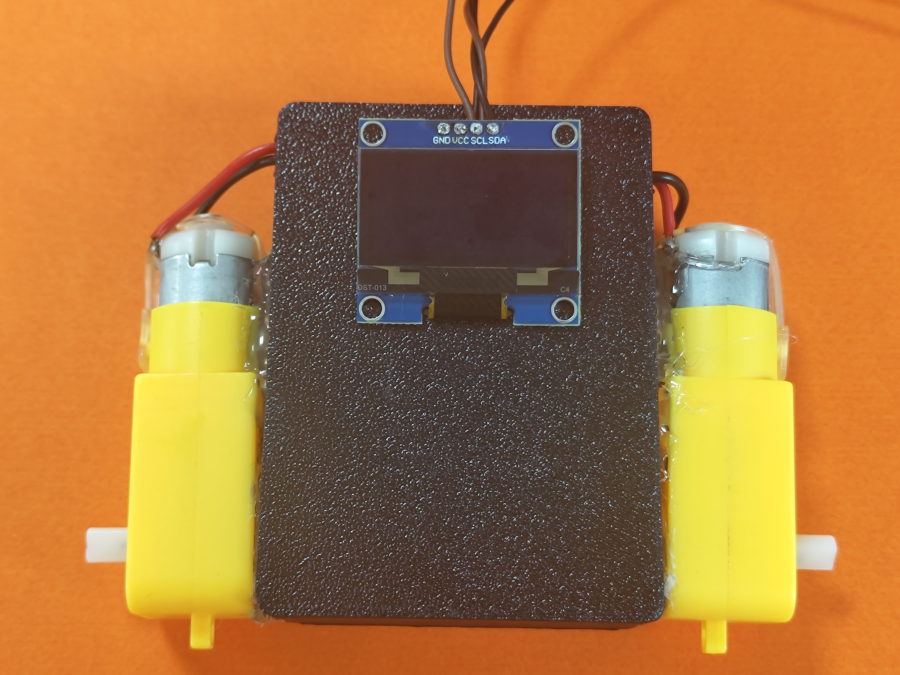
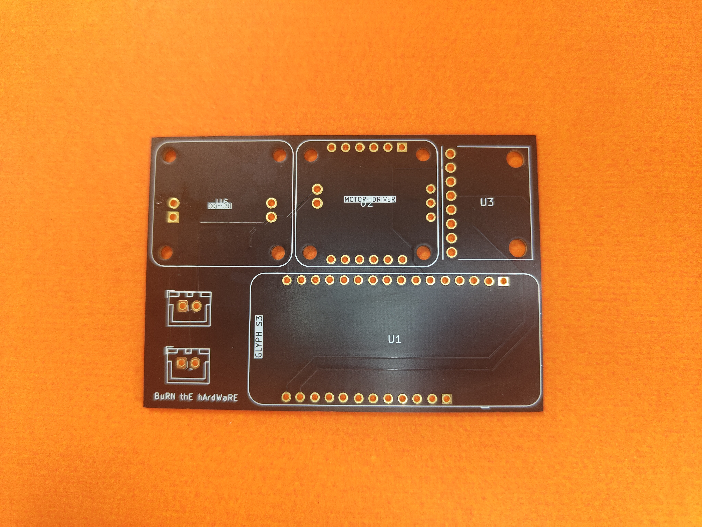
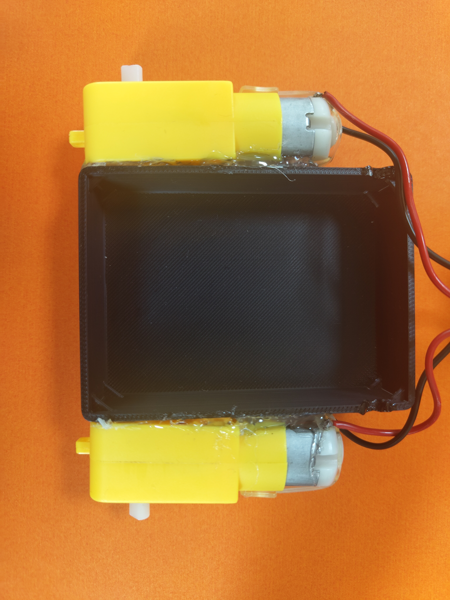
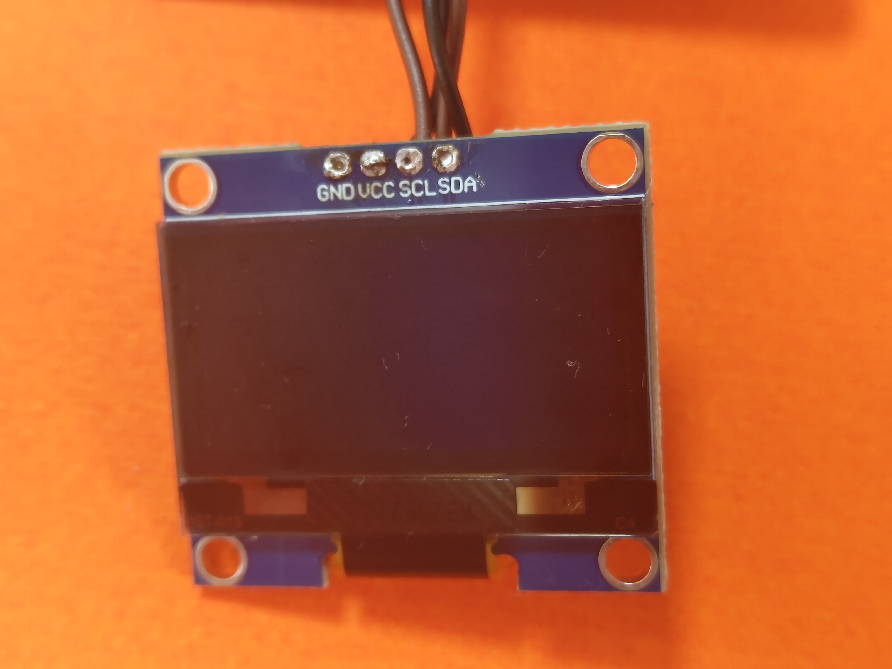
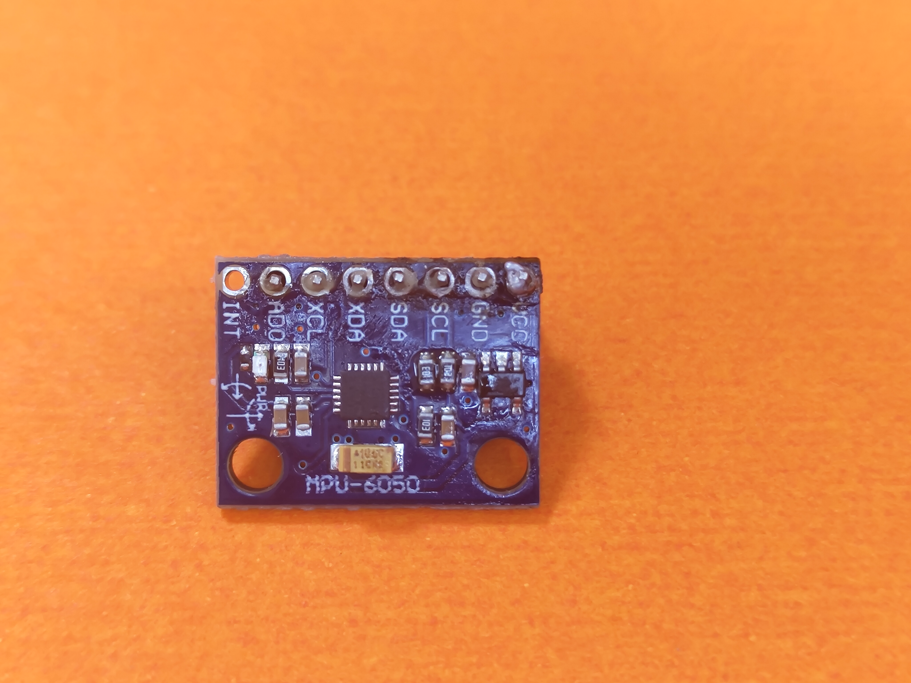
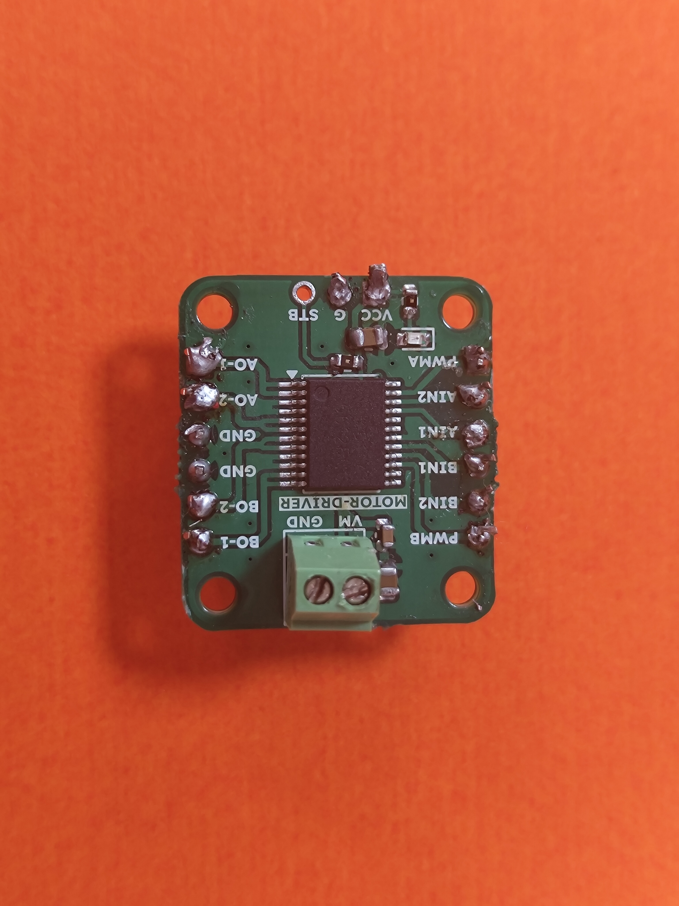
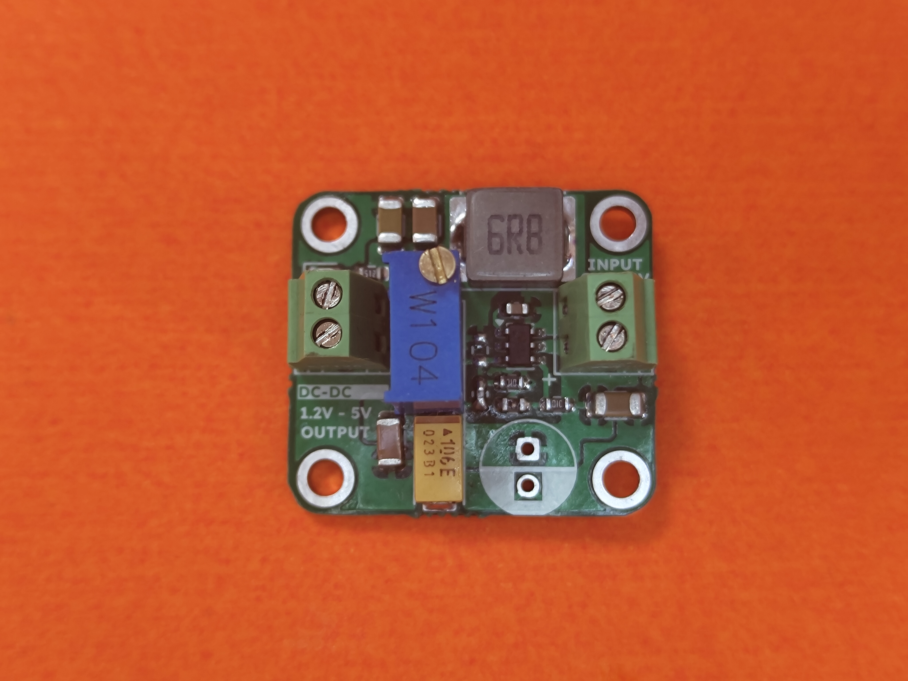
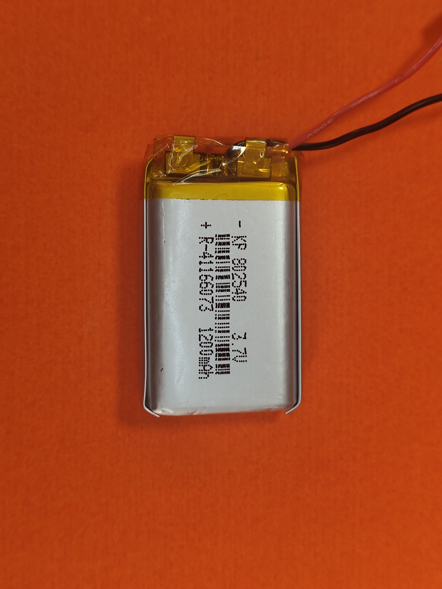
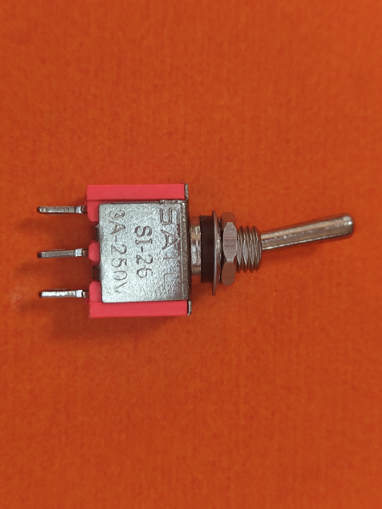
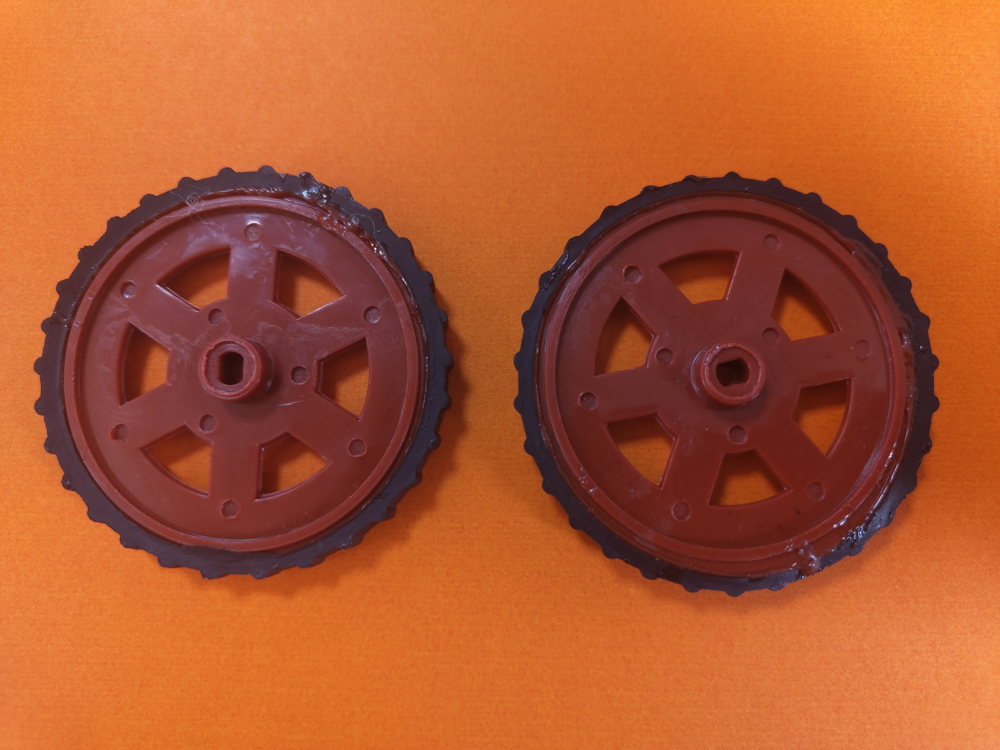

# E-01 Drive

This repository contains the documentation and design package for `E-01 Drive`, a hardware platform built to make PID tuning easier on real systems. The current prototype is a compact self-balancing robot style control platform built around an ESP32-S3, MPU-6050, motor driver, OLED, battery power stage, custom PCB, and mechanical chassis.

## 1. Title of the Project

`E-01 Drive: AI-Assisted PID Tuning Platform for a Self-Balancing Robot`

## 2. Problem Statement

PID controllers are widely used in robotics and embedded systems, but tuning them on real hardware is still difficult. In most student and prototype projects, tuning is done by manual trial-and-error. This wastes time, increases instability during testing, and makes it hard to reach a reliable operating point quickly.

For a self-balancing robot, the problem becomes even harder because small changes in gains can produce oscillation, overshoot, or immediate failure. A practical system is needed that can reduce the effort of selecting good PID gains while still working on real hardware.

## 3. Objective

The objective of E-01 Drive is to simplify and accelerate PID tuning by combining:

- a real embedded hardware platform,
- live sensing and motor actuation,
- a structured tuning workflow,
- and an AI-assisted tuning engine that can suggest updated gains from measured hardware responses.

The project aims to reduce manual tuning effort while improving repeatability, speed of iteration, and clarity during testing.

## 4. Existing Work

The project builds on the following common approaches already used in control engineering and robotics:

- Manual PID tuning by observing overshoot, settling time, and steady-state error.
- Classical heuristics such as Ziegler-Nichols style gain estimation.
- Simulation-first controller development before real hardware deployment.
- Adaptive and learning-based tuning methods explored in academic and industrial control systems.
- Reinforcement learning approaches for automatic controller optimization.

Within this project itself, an earlier software approach attempted TD3-based reinforcement learning for automatic PID tuning across simulated systems, but it did not produce reliable enough results for deployment on the real robot.

## 5. Gap Analysis

Existing PID tuning approaches still leave several gaps for student-built real hardware systems:

- Manual tuning is slow and highly dependent on user experience.
- Classical formulas are often too coarse for unstable or nonlinear platforms like self-balancing robots.
- Simulation-only results do not always transfer well to real hardware.
- Reinforcement learning methods can be complex to train and may fail to generalize reliably.
- Many systems do not provide a simple end-to-end workflow that connects hardware measurements directly to gain recommendations.

This gap creates a need for a practical platform that combines real hardware experimentation with a smarter iterative tuning process.

## 6. Novelty

The novelty of E-01 Drive is the combination of:

- a real self-balancing robot style hardware platform,
- a custom PCB for integrating sensing, control, motor drive, and power,
- and an AI-assisted tuning loop that uses measured hardware response data to guide PID updates.

Rather than treating PID tuning as a one-time manual setup step, the project treats tuning as an iterative data-driven workflow with both offline and online phases. This makes the prototype different from a simple balancing bot or a standard fixed-gain controller demo.

## 7. Your Project Description

E-01 Drive is a compact embedded hardware platform designed to evaluate and improve PID tuning on a real robotic system. The prototype uses:

- an ESP32-S3 development board as the main controller,
- an MPU-6050 IMU for motion sensing,
- a dual motor driver to control the two drive motors,
- an OLED display for local status output,
- a DC-DC module and battery-powered supply chain,
- a custom PCB to organize the electronics,
- and a two-wheel chassis suitable for balancing and motion-control experiments.

The control workflow is built around a self-balancing robot use case. The robot measures tilt and motion, applies PID control through the motors, and records system behavior. An external tuning service can then analyze the response and suggest better gain values. This creates a tighter loop between observation, tuning, testing, and retesting.

## 8. List of Components and the Software Used

### Hardware Components

| Component | Purpose |
| --- | --- |
| ESP32-S3 board | Main microcontroller and control execution |
| MPU-6050 IMU | Tilt and motion feedback |
| Motor driver module | Drives the left and right DC motors |
| OLED display | Local status and tuning output |
| DC-DC converter | Voltage regulation |
| Toggle switch | Power control |
| 3.7V 1200mAh battery | Portable power source |
| Two TT gear motors | Actuation |
| Two wheels | Locomotion and balance support |
| Custom PCB | Interconnect and integration platform |
| Mechanical chassis/body | Prototype structure |

### Software and Tools Used

| Software / Tool | Purpose |
| --- | --- |
| KiCad 9 | Schematic and PCB design |
| Gerber export tools | Manufacturing output generation |
| FastAPI | Backend service for tuning workflow |
| Cloud LLM tuner | Gain recommendation and adaptive tuning logic |
| SvelteKit website repo | Public project presentation and documentation |
| STEP / STL / GLB exports | 3D model sharing and fabrication references |

## 9. Methodology

The project methodology combines hardware design, embedded control, and AI-assisted tuning:

1. Design and fabricate a compact PCB for the controller, IMU, motor driver, and power modules.
2. Assemble a robot platform with two motors, wheels, battery supply, and control electronics.
3. Read tilt and motion data from the IMU using the controller.
4. Run a PID-based control loop on the hardware platform.
5. Perform exploratory hardware runs to collect response metrics.
6. Use measured values such as settling time, overshoot, steady-state error, and stability to guide gain updates.
7. Iterate until the system reaches improved behavior.

The broader tuning concept is divided into:

- `Offline tuning`: structured initial tuning using exploratory runs and recorded results.
- `Online tuning`: adaptive updates based on new disturbances or live system behavior.

## 10. Work Flow

The current project workflow can be described as:

1. Power the robot through the battery, switch, and DC-DC stage.
2. Read angle and motion feedback from the MPU-6050.
3. Execute the control loop on the ESP32-S3.
4. Drive the motors through the motor driver.
5. Observe system behavior on the hardware platform.
6. Record response metrics from each trial.
7. Send the results to the tuning workflow.
8. Receive improved PID gains.
9. Re-apply the gains on hardware and repeat.

The software architecture currently described for the tuning engine includes:

- `/init_session`
- `/answer_questions`
- `/send_results`
- `/accept`
- `/start_adaptive`
- `/breach`

These endpoints represent the offline and adaptive tuning phases of the project.

## 11. Pic of the Project / Prototype

### Assembled Prototype

### Custom PCB

### Chassis and Motors

## 12. Demo Video

Software demo video file available locally: `2026-04-12 14-31-13.mkv`

Important note: the provided video file is approximately 177 MB, which exceeds GitHub's normal 100 MB file-size limit for repository commits. To complete the final submission cleanly, this video should be uploaded to a public hosting platform such as YouTube or Google Drive, and that public link should be placed here before judging.

## 13. Public GitHub Repo Deliverables

Public repository: [BuRN-thE-hArdWaRE/burn-the-hardware.github.io](https://github.com/BuRN-thE-hArdWaRE/burn-the-hardware.github.io)

### Schematics and Circuit Design

- [KiCad schematic](hardware/kicad/E-01%20Drive.kicad_sch)
- [KiCad project file](hardware/kicad/E-01%20Drive.kicad_pro)

Note: the current schematic file exists in the repository, but it is still largely incomplete and should be finished for a fully reproducible hardware submission.

### PCB Layout (KiCad Project File)

- [PCB layout](hardware/kicad/E-01%20Drive.kicad_pcb)
- [KiCad project](hardware/kicad/E-01%20Drive.kicad_pro)

### Gerber File

- [Gerber folder](hardware/gerber/team5_gerber_x2/)
- [Gerber ZIP package](hardware/gerber/team5_gerber_x2/team-5_gerber.zip)

### Source Code

- [Website source](src/)
- [Firmware and tuning architecture note](firmware/README.md)

Important note: actual firmware source files were not present in the local workspace provided for this update. This repository now includes the firmware architecture description, but the embedded source code should still be added if you want the submission to include the full software implementation.

### 3D Model With Specifications

- [STEP model](hardware/models/E-01%20Drive.step)
- [STL model](hardware/models/E-01%20Drive.stl)
- [GLB model](hardware/models/E-01%20Drive.glb)

These files provide the current 3D representation of the mechanical and hardware package available in the workspace.

## Firmware and Tuning Architecture Summary

The current tuning architecture is based on a hybrid control workflow:

- the ESP32-S3 executes the live control loop on the robot,
- the MPU-6050 provides motion feedback,
- the motor driver applies actuator output,
- and an external AI-assisted tuning service recommends PID gains from observed hardware results.

An earlier TD3 reinforcement learning approach was explored and later abandoned due to unreliable performance for real-world deployment. The current approach uses a cloud LLM with a FastAPI-based session workflow for offline and online gain adjustment.

Additional firmware notes are available in [firmware/README.md](firmware/README.md).

## Additional Project Images

### OLED Module

### IMU Module

### Motor Driver

### Power Section

### Wheels

